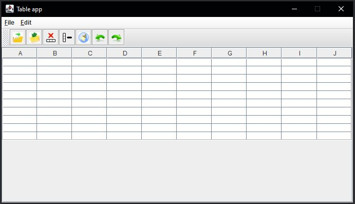
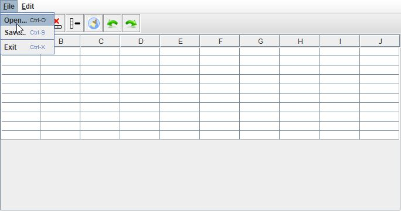
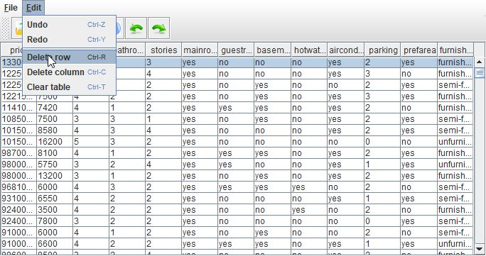
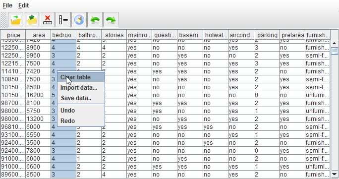
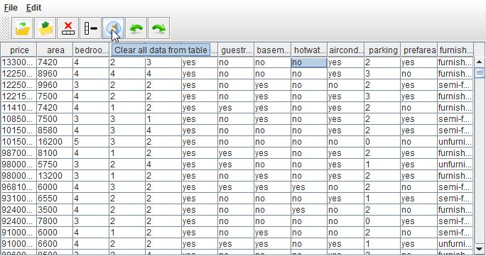

# DRUGI ZADATAK
---

Kako možete vidjeti ovdje se radi "samo" o jenom zadatku u kojem trebate napraviti traženi GUI i implementirati `Command Pattern`. 

## ZADATAK 2-1 :

Potrebno je da napravite GUI prema slici 1 koji predstavlja aplikaciju za pregled `csv` datoteka. Zbog jednostavnosti ćemo smatrati kako svaka `csv` datoteka ima zaglavlje (eng. header) s nazivima stupaca. Potrebno je da zadovoljite sljedeće specifikacije:
  
  - `Menu bar` treba imati dva menija &rarr; `File` i `Edit` 
    - `File` ima `Open`, `Save` i `Exit`
    - `Edit` ima `Undo`, `Redo`, `Delete row`, `Delete column` i `Clear table`
    - Implementirajte i pripadne tipkovničke kratice &rarr; sami izabirete kratice (npr. Undo može biti `CTRL + Z`, a brisanje retka `CTRL + R`)
  - `Tool Bar` treba imati naredbe za `Open`, `Save`, `Delete row`, `Delete column`, `Clear table`, `Undo` i `Redo`
  - Početne dimenzije osnovne (prazne) tablice proizvoljno definirajte
  - Osigurajte prikaz podataka u tablici iz bilo koje `csv` datoteke koja ima zaglavlje (header)
  - Omogućite spremanje podataka iz tablice u proizvoljnu `csv` datoteku
  - Dijalog za otvaranje i spremanje datoteka treba izvorno pokazivati na mapu `data` koju imate kao dio polaznog repozitorija
  - Sve naredbe realizirajte korištenjem predloška `Command`
  - Osigurajte ispis stanja stogova `UndoStack` i `RedoStack` u konzolu
  
 Vodite računa kako undo i redo imaju svoju logiku kod svake naredbe &rarr; primjerice ukoliko izaberete brisanje selektiranog retka pripadni undo podrazumijeva njegov "povratak"u tablicu na istu poziciju. Isto tako, kada napravite undo nakon `Clear table` cijeli prethodni sadržaj kojeg ste "očistili" treba biti vraćen u tablicu. 
  
> **VAŽNO**: slike za `Tool bar` ikone obavezno preuzimajte pod licencom `Creative Commons` ili pod bilo kojom licencom koja **omogućuje besplatno korištenje ikona**

**Slika 1** Izgled GUI-a 
  

**Slika 2** Izgled File menija
  

**Slika 3** Delete Row iz Edit menija 
  

  
**Slika 4** Kontekstualni, skočni izbornik (eng. Pop-Up Menu)
  
  

  
**Slika 5** Pridružen tzv. Tool-Tip text uz svaku ikonu na alatnoj traci &rarr; Clear za primjer
  

> **NAPOMENA** Radni tok **commita** treba slijediti uputu iz polazne **Readme** datoteke ovog repozitorija
 
